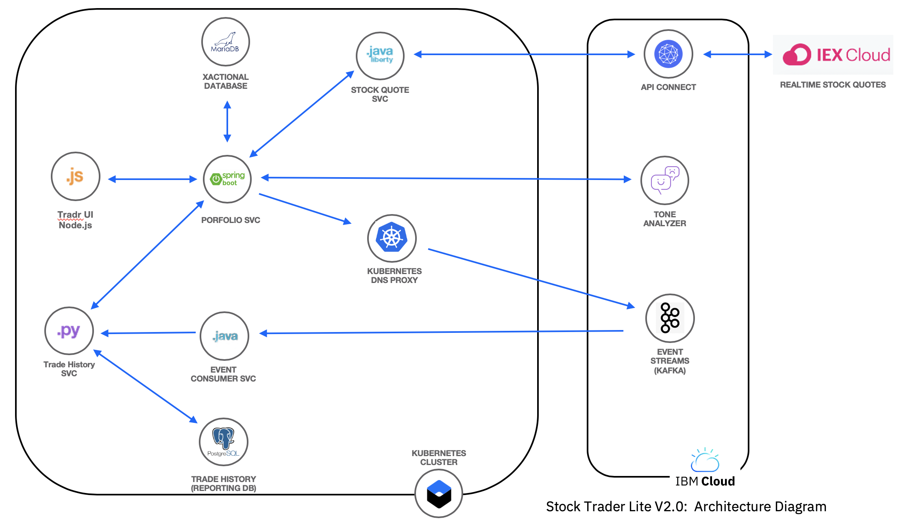
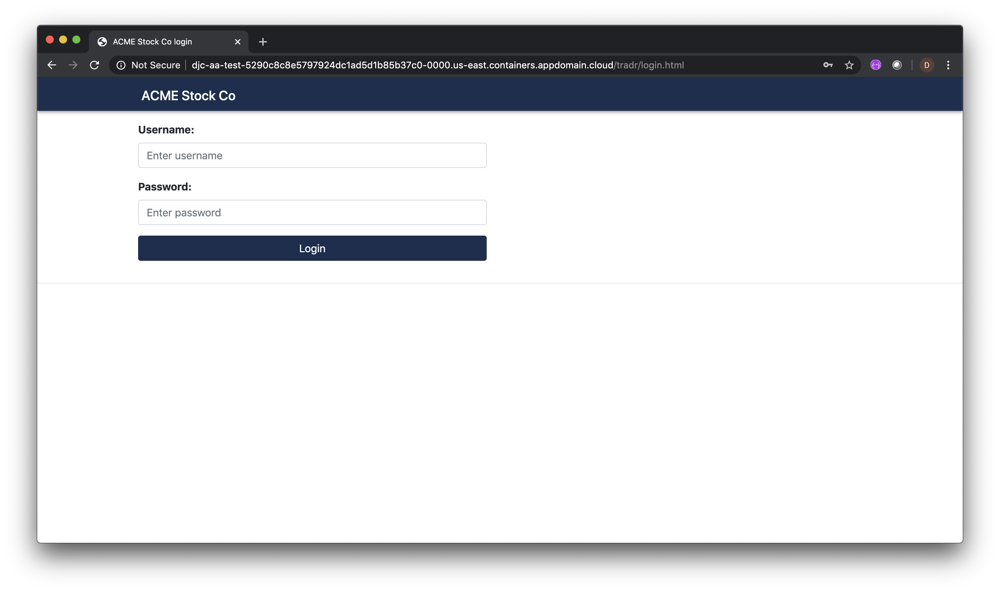
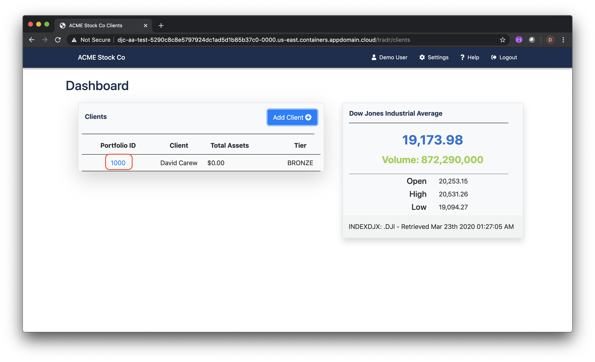
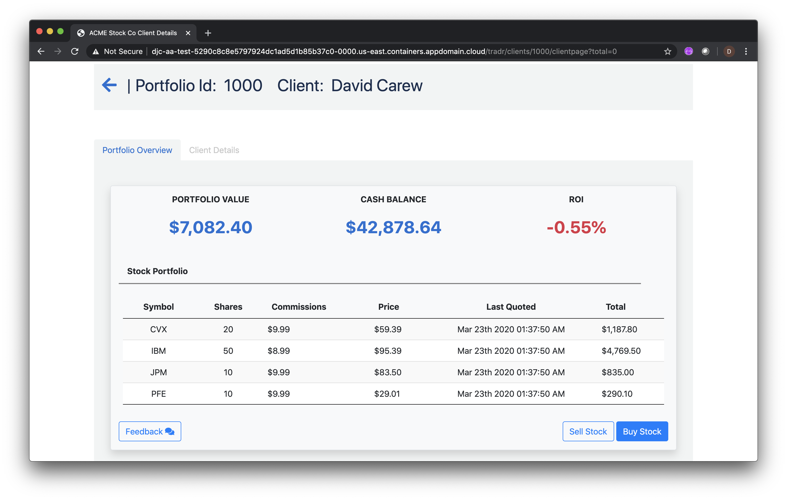
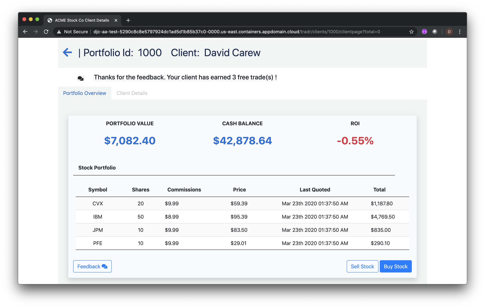
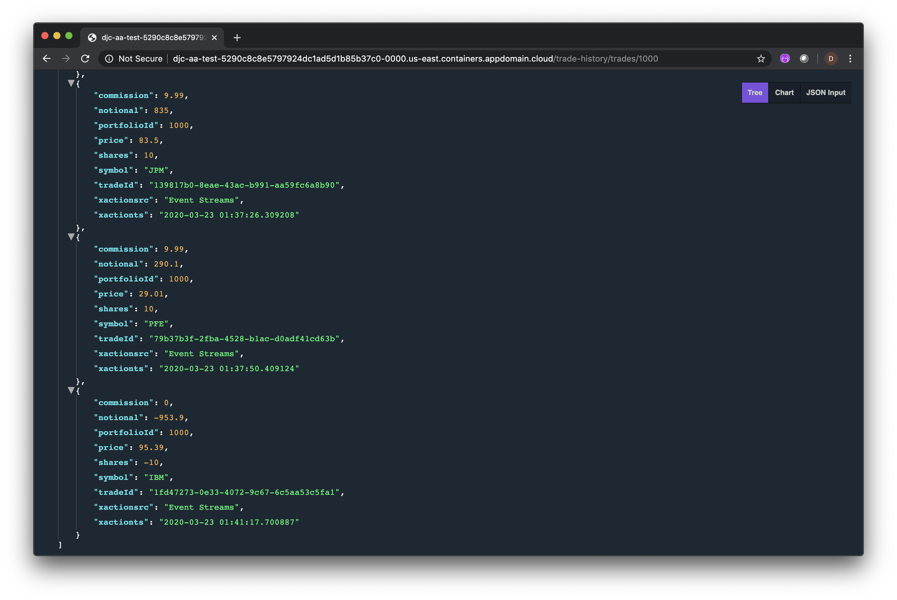

# Deploying and testing a microservices application in Kubernetes

In this lab you will deploy and test the *IBM Stock Trader Lite V2.0* application in the IBM Cloud Kubernetes Service.

The *IBM Stock Trader Lite V2.0*  application is a polyglot  stock trading sample, where you can create various stock portfolios and add shares of stock to each for a commission. It keeps track of each porfolio’s total value and its loyalty level, which affect the commission charged per transaction. It also lets you submit feedback on the application, which can result in earning free (zero commission) trades, based on the tone of the feedback. (Tone is determined by calling the Watson Tone Analyzer).

The architecture of the  app is shown below:



* **Tradr** is a Node.js Express  UI for the portfolio service that implements the Backend for Frontend (BFF) pattern.

* The **stock-quote** is a Open Liberty service that queries an external service to get real time stock quotes via an API Connect proxy.

* The **portfolio** microservice is a Spring Boot application that  sits at the center of the Stcok Trader V2.0 app. This microservice:

   * persists trade data using JDBC to a MariaDB database
   * invokes the **stock-quote** service to get stock quotes
   * sends completed transactions to a local DNS proxy to IBM Event Streams running in the IBM Cloud
   * calls the **trade-history** service to get aggregated historical trade data

* The **event-consumer** microservice is a POJO application that receives the transaction data from  Event Streams and calls the  **trade-history** service to publish the data to the reporting database.

* The **trade-history** microservice is a Python Flask application the manages historical trading data in a PostgreSQL database.

This lab is broken up into the following steps:


1. [Check prerequisites](#step-1-check-prerequisites)

1. [Prepare for installation](#step-2-prepare-for-installation)

1. [Install all the prerequisites](#step-3-install-all-the-prerequisites)

1. [Install the Stock Trader Lite app](#step-4-install-the-stock-trader-lite-app)

1. [Test the app](#step-5-test-the-app)

1. [Cleanup](#step-6-cleanup)

1. [Summary](#summary)


### Step 1: Check prerequisites

1.1 Verify command line access to your cluster by entering the following command from  web based terminal you're using for the labs. Substitute you cluster name for *CLUSTER_NAME*

  ```
  ibmcloud cs cluster get [CLUSTER_NAME]
  ```   

  You should get output that looks looks something like the following:

```
Retrieving cluster user001-cluster...
OK


Name:                           user001-cluster
ID:                             bpqalm9w0fg8b11rdi1g
State:                          normal
Created:                        2020-03-20T11:36:57+0000
Location:                       wdc04
Master URL:                     https://c1.us-east.containers.cloud.ibm.com:29560
Public Service Endpoint URL:    https://c1.us-east.containers.cloud.ibm.com:29560
Private Service Endpoint URL:   -
Master Location:                Washington D.C.
Master Status:                  Ready (2 days ago)
Master State:                   deployed
Master Health:                  normal
Ingress Subdomain:              user001-cluster-5290c8c8e5797924dc1ad5d1b85b37c0-0000.us-east.containers.appdomain.cloud
Ingress Secret:                 user001-cluster-5290c8c8e5797924dc1ad5d1b85b37c0-0000
Workers:                        2
Worker Zones:                   wdc04
Version:                        1.16.8_1526
Owner:                          -
Monitoring Dashboard:           -
Resource Group ID:              2a926a9173174d94a6eb13284e089f88
Resource Group Name:            default
```

1.2 Verify you have Helm V3.1 by entering the following command from  web based terminal you're using for the labs

  ```
  helm version
  ```  
  You should get output that looks looks something like the following:

  ```
  version.BuildInfo{Version:"v3.1.1", GitCommit:"afe70585407b420d0097d07b21c47dc511525ac8", GitTreeState:"clean", GoVersion:"go1.13.8"}
  ```

1.3 **USERNAME** or **STUDENTID** env var set in your web based terminal. Ask your instructor for the correct setting for these variables if both of the following commands  return empty values:

  ```
  echo $USERNAME
  echo $STUDENTID
  ```

###  Step 2: Prepare for installation

Like a typical  Kubernetes app, Stock Trader use secrets and ConfigMaps to store information needed by one  or more microservices to access external services and other microservices. We've  provided that info in a file hosted in Cloud Storage and there is a script that you'll use to retrieve it.

2.1 From a terminal window clone the Github repo that has everything needed to deploy the aggregated Stock Trader app.

  ```
  git clone https://github.com/IBMStockTraderLite/stocktrader-iks.git
  ```

2.2 Go to the directory required to run the setup scripts

  ```
  cd stocktrader-iks/scripts
  ```

2.3 Retrieve credentials and other details needed to create secrets and/or ConfigMaps. Ask you instructor for the **SETUPURL** for the command below.

  ```
  ./setupLab.sh SETUPURL
  ```

2.4 Verify that the output looks something like the following:

```
Script being run from correct folder
Using duser001-cluster as IKS cluster name
Using stocktrader-user001 as Kakfa Topic name
Validating setup URL ...
Getting Ingress subdomain for cluster user001-cluster  ...
Updating Stock Trader Helm chart with ingress subdomain: user001-cluster-5290c8c8e5797924dc1ad5d1b85b37c0-0000.us-east.containers.appdomain.cloud
Updating variables.sh with Kafka topic : stocktrader-user001
Setup completed successfully
```

2.5  Also verify that there is now a file called **variables.sh** in the current folder

## Step 3: Install all the prerequisites

In this part  you'll install the prereqs step by step before installing the Stock Trader V2.0 application.

3.1 Install MariaDB by running the following command. Verify that no errors are displayed by the installation script.

 ```
 ./setupMariaDB.sh
 ```

3.2 Install PostgreSQL by running the following command. Verify that no errors are displayed by the installation script.

 ```
 ./setupPostgreSQL.sh

 ```

3.3 Create the DNS Proxy and store all the  access information as secrets  for the  external Kafka installation. Verify that no errors are displayed by the script.

 ```
 ./setupKafka.sh

 ```

3.4 Store all the  access information as secrets for the API Connect proxy to the external  realtime stock quote . Verify that no errors are displayed by the script.

 ```
 ./setupAPIConnect.sh

 ```

3.5 Store all the  access information as secrets for the  external  Watson Tone Analyzer service . Verify that no errors are displayed by the script.

 ```
 ./setupWatson.sh

 ```

3.6 Verify your progress so far. Run the following to see the running pods:

 ```
 kubectl get pods
 ```

The output should show  the 2 database  pods which should be running and in the **READY** state.

 ```
 NAME                            READY   STATUS    RESTARTS   AGE
stocktrader-db-mariadb-0        1/1     Running   0          70s
stocktrader-hist-postgresql-0   1/1     Running   0          57s
 ```

3.7 Next look at your services

 ```
 kubectl get svc
 ```

3.9 Verify that the output includes services for MariaDB, PostgreSQL and your DNS proxy to Kafka

```
NAME                                   TYPE           CLUSTER-IP      EXTERNAL-IP  
stocktrader-db-mariadb                 ClusterIP      172.21.216.8    <none>                                                                
stocktrader-hist-postgresql            ClusterIP      172.21.235.35   <none>                                                                    
stocktrader-pubsub-kafka-dns-proxy     ExternalName   <none>          broker-0-0mqz41lc21pr467x.kafka.svc01.us-south.eventstreams.cloud.ibm.com
```

###  Step 4: Install the Stock Trader Lite app

In this part you'll install all the Stock Trader Lite V2.0  microservices using a Helm chart that has templates for all the microservices. Note that  the  microservices require  the information stored via secrets in the scripts you ran in the previous section.

4.1  Go back to the top level folder of the  cloned repo

 ```
 cd ..
 ```

4.2 Install the Helm chart. Verify that no errors are displayed

 ```
 helm install stocktrader stocktrader
 ```
4.3 The output of the helm command should look something like the following:

```
NAME: stocktrader
LAST DEPLOYED: Sun Mar 22 16:01:54 2020
NAMESPACE: default
STATUS: deployed
REVISION: 1
TEST SUITE: None
NOTES:
Stock Trader Lite V2.0 is deployed.

The Tradr web application is available at:
  http://user001-5290c8c8e5797924dc1ad5d1b85b37c0-0000.us-east.containers.appdomain.cloud/tradr

This is the base  external URL for the Trade History Service:
     http://user001-5290c8c8e5797924dc1ad5d1b85b37c0-0000.us-east.containers.appdomain.cloud/trade-history
```

4.4 Verify that all the pods are running by running the following command. Note you may have to run this command multiple times before all the pods become READY.

 ```
 kubectl get pods
 ```

4.5 Keep running the command until the output looks something like the following. NOTE: It can take 30 seconds  or more for all the pods to reach the **READY** state.

```
NAME                                      READY   STATUS    RESTARTS   AGE
event-streams-consumer-5dbfc5bb46-lvbhg   1/1     Running   0          89s
portfolio-6d4b99dc88-28b8v                1/1     Running   0          89s
stock-quote-695cc88b48-jzmwx              1/1     Running   0          89s
stocktrader-db-mariadb-0                  1/1     Running   0          12m
stocktrader-hist-postgresql-0             1/1     Running   0          12m
trade-history-59cbc8fb59-8p26d            1/1     Running   0          89s
tradr-7fcd7c4bdf-5td8h                    1/1     Running   0          89s  
```

### Step 5: Test the app

In this part you'll verify that the various microservices are working as designed.

5.1 Get the external URL of the **tradr** web app by running the following command:

   ```
   helm get notes stocktrader
   ```
5.2 Open the displayed URL with your browser to bring up the login page:

   

5.3 Log in with the following credentials (note these are the only values that will work)

   ```
   username:  stock
   password: trader
   ```

5.4 Click **Add Client** and fill in the requested values to create a new client.  Click **Save**

  

5.5  Click on the link in the **Portfolio ID** column to see the  details of the new client.

  

5.6 Do 3 or 4 "Buy" operations with different stocks.

  

5.7 Sell part of one of the holdings you just bought and verify that the **Shares** column in the table is updated appropriately.

5.8 Click on **Feedback** and submit some client feedback to be analyzed by Watson Tome Analyzer. Try to sound as angry as possible with the feedback. The app will award 3 free trades for very angry feedback and 1 free trade for feedback that is only slightly angry or not angry at all.

  

5.9  Verify that the following data flow:

  **Portfolio Svc--->Kafka--->Event-Consumer-Svc--->Trade-History-Svc--->PostgreSQL(Trade History DB)**

  works by querying the **trade-history** service for all trades in a portfolio.

  Run the following command to get the base external URL of the Trade History Service:

   ```
   helm get notes stocktrader
   ```

5.10 Copy the URL into a new browser tab and append the path `/trades/1000` to it. For example if the URL  is `http://user049-cluster.us-east.containers.appdomain.cloud/trade-history/` then the full URL will be `http://user049-cluster.us-east.containers.appdomain.cloud/trade-history/trades/1000`

5.11 Verify that the returned output is in JSON format and that the history has captured  all the trades you did while testing. A screenshot of the kind of the data that should be returned is shown below.

  

### Step 6: Cleanup

Free up resources for subsequent labs by deleting the Stock Trader app.

6.1 Run the following commands to cleanup (note: you can copy all the commands at once and post then into your command window)

   ```
   cd scripts
   helm uninstall stocktrader
   ./cleanupWatson.sh
   ./cleanupAPIConnect.sh
   ./cleanupKafka.sh
   ./cleanupMongo.sh
   ./cleanupMariaDB.sh
   cd -
   ```


### Summary
You installed and then tested the  Stock Trader Lite V2.0  microservices sample application and got some insight into the challenges of deploying microservices apps in a Kubernetes cluster.
